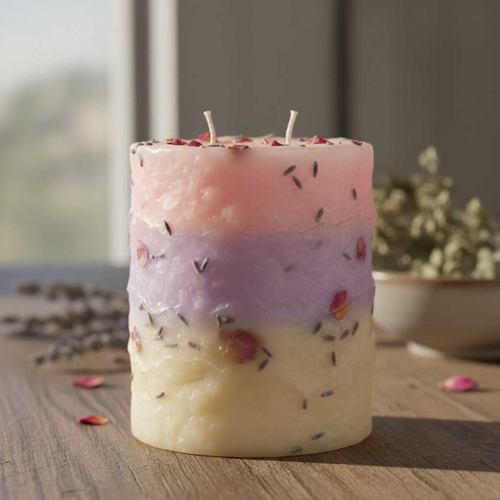

# 🕯️ AI Candle Designer

A collection of AI-powered Streamlit applications for creating custom candle designs and wraps.

## 📦 Applications

### 1. Candle Design Generator (`app.py`)
Generate realistic candle designs from text descriptions using Google's Gemini 2.5 Flash Image API.

**Features:**
- 🎨 AI-Powered image generation
- 📝 Natural language input
- 🎭 Style keywords support
- 💾 PNG download
- 🖼️ Gallery with example designs

### 2. Street View Candle Wrap Generator (`GoogleStreetView.py`)
Create custom candle wraps using Google Street View panoramas and AI enhancement.

**Features:**
- � Fetch Street View tiles from any location
- 📸 360° panoramic tile preview
- 🤖 AI-powered wrap generation with Gemini
- 📐 Custom dimensions and DPI settings
- 🎨 Automatic aspect ratio handling
- 💾 PNG download with target dimensions

## 🚀 Quick Start

### Prerequisites

- Python 3.8 or higher
- Google Maps API key (for Street View app)
- Gemini API key (for both apps)

### Installation

1. **Clone the repository**
```bash
git clone https://github.com/ellatuanzi/ai-candle-designer.git
cd ai-candle-designer
```

2. **Create virtual environment**
```bash
python -m venv .venv
source .venv/bin/activate  # On macOS/Linux
# or
.venv\Scripts\activate  # On Windows
```

3. **Install dependencies**
```bash
pip install -r requirements.txt
```

### Get API Keys

#### Gemini API Key
1. Visit [Google AI Studio](https://aistudio.google.com/app/apikey)
2. Sign in with your Google account
3. Create a new API key
4. Copy the API key

#### Google Maps API Key (for Street View app)
1. Visit [Google Cloud Console](https://console.cloud.google.com/)
2. Create a new project or select existing
3. Enable "Street View Static API"
4. Create credentials (API key)
5. Copy the API key

## 📱 Running the Applications

### Candle Design Generator

```bash
streamlit run app.py
```

Open your browser to `http://localhost:8501`

**Usage:**
1. Enter Gemini API key in sidebar
2. Describe your candle design
3. Add optional style keywords
4. Click "Generate Candle Image"
5. Download the result

### Street View Candle Wrap Generator

```bash
streamlit run GoogleStreetView.py
```

Open your browser to `http://localhost:8502` (or another port if 8501 is taken)

**Usage:**
1. Enter Google Maps API key in sidebar
2. Enter Gemini API key in sidebar
3. Set location coordinates (latitude/longitude)
4. Configure dimensions (physical mm or pixels)
5. Click "Generate Wrap"
6. Preview Street View tiles
7. Describe desired wrap design
8. Click "Generate with Gemini AI"
9. Download the AI-enhanced wrap

## 📁 Project Structure

```
ai-candle-designer/
├── app.py                    # Main candle design generator
├── GoogleStreetView.py       # Street View wrap generator
├── requirements.txt          # Python dependencies
├── README.md                # This file
├── .gitignore               # Git ignore rules
├── image_example/           # Example generated candles
│   ├── example1.png
│   ├── Gradient Sunset Candle.png
│   ├── Modern Minimalist Candle.png
│   └── Rustic Beeswax Candle.png
└── .venv/                   # Virtual environment (not in git)
```

## 🎨 Gallery

### Street View Candle Wrap Examples

#### Forbidden City Wrap


---

### AI-Generated Candle Designs

#### Multi-Layer Botanical Candle


**Prompt:** A multi-layer pillar candle, each layer a different natural wax color (cream, soft lavender, pale pink), with dried lavender flowers and rose petals embedded realistically inside the wax.

---

### Rustic Beeswax Candle


**Prompt:** A handmade beeswax candle with natural honeycomb texture on the surface. Natural amber and golden colors. Wrapped with natural jute twine and decorated with dried eucalyptus leaves.

---

### Modern Minimalist Candle


**Prompt:** A modern concrete candle holder with minimalist geometric design, containing a smooth white soy wax candle.

---

### Gradient Sunset Candle


**Prompt:** A pillar candle with smooth gradient from coral pink at the bottom to soft peach to cream white at the top.

## 💡 Tips for Best Results

### Candle Design Generator (app.py)
- Be specific about materials (soy wax, beeswax, paraffin)
- Describe layer structure and boundaries clearly
- Mention realistic decorations (embedded flowers, not floating)
- Include texture details (smooth, honeycomb, slightly uneven)

### Street View Wrap Generator (GoogleStreetView.py)
- Choose locations with interesting architecture or scenery
- Use smaller FOV (15-26°) for less distortion
- Adjust pitch for better building views
- Provide detailed prompts to Gemini about desired artistic style
- The app will automatically resize output to match your target dimensions

## 🔧 Technical Details

### Dependencies
```
streamlit>=1.51.0
google-genai>=1.50.1
Pillow>=12.0.0
reportlab>=4.4.5
requests>=2.31.0
```

### AI Models Used
- **Gemini 2.5 Flash Image**: For candle design generation
- **Gemini 2.5 Flash Image**: For Street View wrap enhancement

### Key Features
- Streaming API for real-time feedback
- Automatic image dimension handling and resizing
- Session state management for tile persistence
- PDF export with crop marks (Street View app)
- Comprehensive error handling

## 🐛 Troubleshooting

### Common Issues

**API Key Error**
```
❌ No API key provided / Please enter your API key
```
**Solution**: Enter your Gemini/Google Maps API key in the sidebar

**No Street View Available**
```
❌ No Street View imagery found at this location
```
**Solution**: Increase search radius, try different coordinates, or check Google Maps for Street View coverage

**Dimension Mismatch**
```
⚠️ Resizing generated image from X×Y to match target
```
**Note**: This is normal - Gemini may not generate exact dimensions, so automatic resizing ensures correct output

**Module Not Found**
```
ModuleNotFoundError: No module named 'reportlab'
```
**Solution**: Activate virtual environment and run `pip install -r requirements.txt`

## 📄 License

MIT License - feel free to use, modify, and distribute!

## 🙏 Acknowledgments

- Built with [Streamlit](https://streamlit.io)
- Powered by [Google Gemini](https://ai.google.dev)
- Image processing with [Pillow](https://python-pillow.org)
- PDF generation with [ReportLab](https://www.reportlab.com)
- Street View data from [Google Maps Platform](https://developers.google.com/maps)

## 📞 Support & Resources

- **Streamlit Docs**: [docs.streamlit.io](https://docs.streamlit.io)
- **Gemini API Docs**: [ai.google.dev/gemini-api/docs](https://ai.google.dev/gemini-api/docs)
- **Google Maps Platform**: [developers.google.com/maps](https://developers.google.com/maps)
- **GitHub Issues**: [Report bugs or request features](https://github.com/ellatuanzi/ai-candle-designer/issues)

---

**Made with ❤️ for candle makers and designers**

## Tips for Best Results

### Design Descriptions
- ✅ Be specific about **materials** (soy wax, beeswax, paraffin)
- ✅ Describe **layer structure** and boundaries clearly
- ✅ Mention **realistic decorations** (embedded flowers, not floating)
- ✅ Include **texture details** (smooth, honeycomb, slightly uneven)
- ✅ Specify **achievable designs** that can be handmade

### What Works Well
- Multi-layer candles with clear boundaries
- Natural wax colors and realistic textures
- Embedded dried flowers or herbs
- Handmade aesthetic with slight imperfections
- Practical container suggestions

### What to Avoid
- ❌ Overly complex or impossible designs
- ❌ Too many conflicting style elements
- ❌ Vague descriptions like "make it pretty"
- ❌ Unrealistic decorations (floating objects, perfect symmetry)

## Troubleshooting

### Common Issues

**API Key Error**
```
❌ No API key provided.
```
**Solution**: Enter your Gemini API key in the sidebar

**Empty Description Error**
```
❌ Please describe your candle design first.
```
**Solution**: Write a description in the text area before generating

**Generation Failure**
```
Model did not return an image.
```
**Solution**: Try a simpler description or check your API quota

**Image Loading Error**
```
cannot identify image file
```
**Solution**: This usually resolves on retry. The API occasionally returns incomplete data.

## Environment Variables

You can also set the API key as an environment variable:

```bash
export GEMINI_API_KEY="your-api-key-here"
streamlit run app.py
```

## Requirements

- **Python**: 3.8 or higher (tested on 3.12)
- **Internet**: Required for API calls to Gemini
- **API Access**: Valid Gemini API key with image generation enabled

## API Costs

Gemini 2.5 Flash Image is part of the Gemini API:
- Check current pricing at [Google AI Pricing](https://ai.google.dev/pricing)
- Free tier available for testing and development
- Image generation counts towards your API quota

## License

MIT License - feel free to use, modify, and distribute!

## Support & Resources

- **Streamlit Documentation**: [docs.streamlit.io](https://docs.streamlit.io)
- **Gemini API Docs**: [ai.google.dev/gemini-api/docs](https://ai.google.dev/gemini-api/docs)
- **Image Generation Guide**: [ai.google.dev/gemini-api/docs/image-generation](https://ai.google.dev/gemini-api/docs/image-generation)
- **Google AI Studio**: [aistudio.google.com](https://aistudio.google.com)

## Contributing

Contributions are welcome! Feel free to:
- Report bugs or issues
- Suggest new features
- Submit pull requests
- Share your generated candle designs

## Acknowledgments

- Built with [Streamlit](https://streamlit.io)
- Powered by [Google Gemini 2.5 Flash Image](https://ai.google.dev)
- Image processing with [Pillow](https://python-pillow.org)

---

**Made with ❤️ for candle makers and designers**

